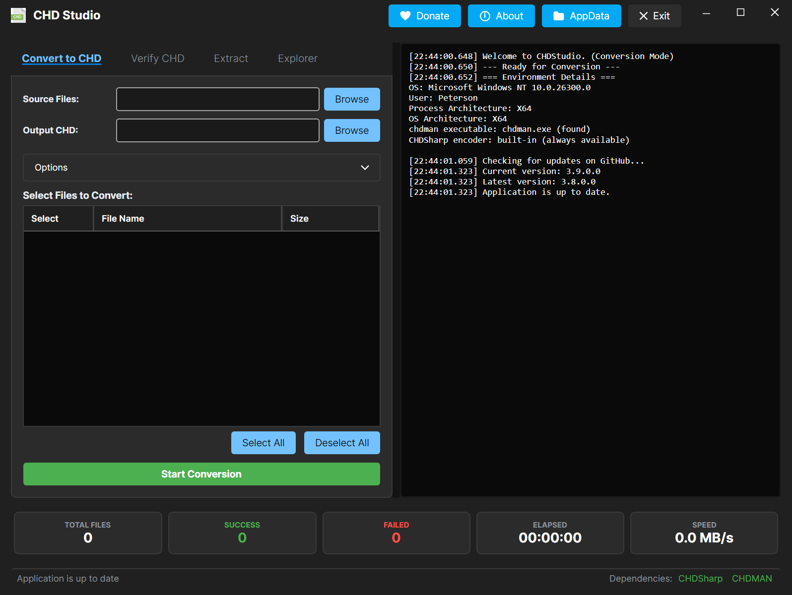
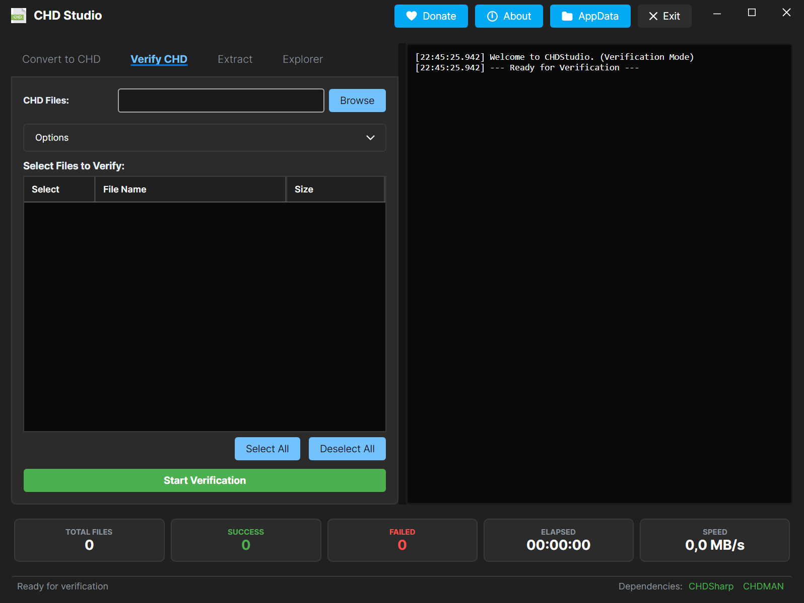
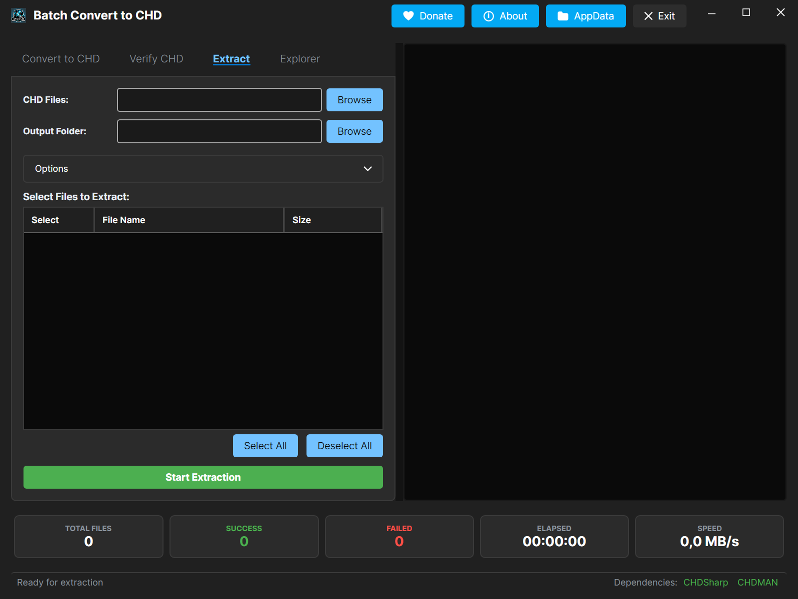
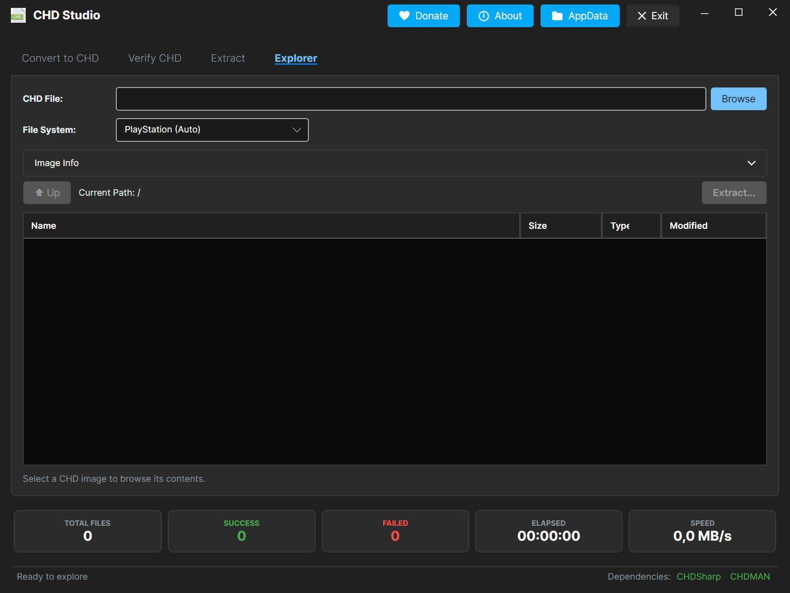

[](https://github.com/purelogiccode/BatchConvertToCHD)
[](https://dotnet.microsoft.com/download/dotnet/10.0)
[](https://github.com/purelogiccode/BatchConvertToCHD/actions/workflows/ci.yml)
[](LICENSE.txt)
[](https://github.com/purelogiccode/BatchConvertToCHD/releases)
[](https://github.com/purelogiccode/BatchConvertToCHD/releases)
[](https://github.com/purelogiccode/BatchConvertToCHD/commits/master)
[](https://github.com/purelogiccode/BatchConvertToCHD/stargazers)
[](https://github.com/purelogiccode/BatchConvertToCHD/issues)
[](https://avaloniaui.net)
[](https://github.com/purelogiccode/BatchConvertToCHD/actions/workflows/release.yml)
[](https://github.com/purelogiccode/BatchConvertToCHD/actions/workflows/docs.yml)
[](https://github.com/purelogiccode/BatchConvertToCHD/releases)
[](https://github.com/purelogiccode/BatchConvertToCHD/graphs/contributors)
[](https://github.com/purelogiccode/BatchConvertToCHD/network/members)
[](https://github.com/purelogiccode/BatchConvertToCHD/watchers)
[](https://github.com/purelogiccode/BatchConvertToCHD/pulls)
[](https://github.com/purelogiccode/BatchConvertToCHD)
[](https://github.com/purelogiccode/BatchConvertToCHD)
[](https://github.com/purelogiccode/BatchConvertToCHD)
[](https://github.com/purelogiccode/BatchConvertToCHD/graphs/commit-activity)
[](https://github.com/purelogiccode/BatchConvertToCHD/pulls)
[](https://github.com/purelogiccode/BatchConvertToCHD)
[](https://www.purelogiccode.com/donate)

# Batch Convert to CHD

**Batch Convert to CHD** is a high-performance cross-platform desktop utility designed to streamline the conversion of various disk image formats into the **Compressed Hunks of Data (CHD)** format.






## 🚀 Key Features

### 💻 Modern Side-by-Side Dashboard
*   **Dual-Pane Interface**: View your settings and file list on the left, while monitoring real-time process logs on the right.
*   **Interactive File Selection**: Automatically scans folders and allows you to manually pick exactly which files to process via a detailed file list.
*   **Optimized File Loader**: Utilizes a chunked loading strategy to maintain UI responsiveness even when scanning directories with thousands of files.
*   **Resizable Layout**: Includes a built-in grid splitter to adjust the balance between the file explorer and the terminal view.

### 💻 Multi-Architecture Support
*   **Native ARM64 & x64**: Automatically detects your system architecture and uses the matching native `chdman` build for conversion on Windows.
*   **OS-Native Tool Selection**: On Windows ARM64 machines the native `chdman_arm64.exe` is preferred even when the app itself runs emulated as x64, and a missing preferred binary falls back to the other architecture's build instead of failing. The built-in CHDSharp encoder is managed code, so it runs natively on every architecture.
*   **Optimized Performance**: Leverages native instructions on ARM64 hardware to reduce overhead during heavy compression tasks.

### 🛠️ Intelligent Conversion & Extraction
*   **Automated Batch Processing**: Convert entire directories of disk images with real-time progress monitoring and immediate cancellation response.
*   **chdman Primary Encoding (Windows)**: On Windows conversions run on the bundled `chdman`, the reference MAME CHD encoder. If chdman is missing or fails, the conversion automatically falls back to the built-in [CHDSharp](https://www.nuget.org/packages/CHDSharp) encoder (CHDSharpLib v1.4.3) running in-process — the project's own managed CHD encoder, whose output is byte-identical to `chdman` (verified across a 56-disc battle corpus). On Linux and macOS the built-in CHDSharp encoder is always used. An encoder always exists, so a batch never refuses to start for a missing encoder.
*   **Recursive Structure Preservation**: Maintains your original directory hierarchy in the output folder when processing subfolders.
*   **Robust Extraction**: Supports extracting CHD files back to **.cue (CD)**, **.iso (DVD)**, **.gdi (Dreamcast/Naomi)**, **.img (HDD)**, and **.avi (laserdisc A/V)** with intelligent flag-based auto-detection using the [CHDSharp](https://www.nuget.org/packages/CHDSharp) library. A/V (laserdisc) CHDs extract **in-process** with CHDSharp's MAME-parity AVI writer, so they no longer need `chdman`; if the built-in reader cannot decode a CHD (corrupt file or an unsupported variant), extraction automatically falls back to `chdman` — including `extractld` (AVI) / `extractraw` for laserdisc CHDs.
*   **Laserdisc A/V Support**: `.avi` laserdisc captures (Daphne-style dumps) convert with `createld` — the A/V `avhu` codec (delta-RLE Huffman video + mono FLAC audio), one frame per hunk — through the built-in CHDSharp encoder on every platform, with output that is byte-identical to `chdman createld`.
*   **Archive Integration**: Transparently handles `.zip`, `.7z`, and `.rar` archives, extracting and processing contents automatically while respecting cancellation tokens. Includes a bundled 7-Zip fallback (`7za.exe` on Windows, `7zz` on Linux/macOS) for archives the built-in extractor cannot read, including unsupported ZIP compression methods and `.7z` files. Split 7-Zip and ZIP volume sets (`.7z.001`/`.zip.001` with later parts beside them) are extracted with that bundled 7-Zip and converted like any other input; multi-part RAR sets (`.partNN.rar`, sets renamed to `.001`, and old-style `.rar` + `.rNN`) are decoded from their first volume, whichever part the batch offers, and only the first volume stays in the list so a set is converted once.
*   **CloneCD Support**: Convert CloneCD `.ccd` disc images to CHD format via the [CCDSharp](https://www.nuget.org/packages/CCDSharp) library. Automatically generates CUE/BIN from `.ccd`/`.img` sets.
*   **CSO Decompression**: Built-in support for `.cso` and `.ciso` (Compressed ISO) files via the [CSOSharp](https://www.nuget.org/packages/CSOSharp) library (supports deflate/zlib and LZ4).
*   **PBP Extraction**: Convert PlayStation `.pbp` files to CHD format via the [PBPSharp](https://www.nuget.org/packages/PBPSharp) library. Single- and multi-disc images authored by popstation, PSX2PSP, iPoPS and pop-fe all extract — including pop-fe's multi-disc containers and uncompressed/stored blocks — and a missing or corrupt PARAM.SFO leaves the disc convertible with empty metadata. Files without a PlayStation disc image (PSP homebrew applications, unsupported or corrupt variants) are detected and skipped with a clear message instead of a generic failure.
*   **Smart CUE Normalization**: Detects the actual encoding of `.cue`/`.toc` files (UTF-8, Shift-JIS, Korean CP949, Cyrillic CP1251, Latin-1 and more), strips UTF-8 BOMs (which chdman's parser cannot handle — they produced the "couldn't find bin file []" error), resolves referenced files case-insensitively and zero-padding-tolerantly (`(Track 2)` vs `(Track 02)`), and hands chdman a self-contained, canonicalized cue set — eliminating the common "couldn't find bin file" failures on non-ASCII and BOM-prefixed cues. Bins are referenced in place via relative paths when possible, so no multi-hundred-MB copies are needed for BOM-only cues.
*   **Raw Audio Track Handling**: Cue files referencing `.raw` audio tracks (common in multi-track CD audio rips) are detected via `GameFileParser`; chdman derives the 2352-byte unit size from the cue's track types, and the `-us 2352` unit-size flag is passed only to `createraw` (which requires it).
*   **Archive Dependency Validation**: Cues, GDI and TOC files extracted from archives are validated before conversion — if the referenced data files are missing from the archive (incomplete download, separate bin archive), the entry is skipped with a clear warning instead of failing inside chdman.
*   **MP3 Audio Track Support**: Cue sheets with MP3 audio tracks — `cue/bin/mp3` and `cue/iso/mp3` sets (common in Neo Geo CD and older PS1 rips) — are automatically decoded to WAV before conversion, because chdman cannot read MP3 tracks. The decoded WAVs are normalized to chdman's exact requirements (44.1 kHz, stereo, 16-bit PCM), with a built-in decoder fallback for systems without Media Foundation.
*   **bin-only Archives**: Archives that contain only `.bin` files (no `.cue`/`.iso` descriptor) now get an auto-generated cue and convert automatically (MODE2/2352 with automatic MODE1/2352 fallback).

### 🔎 Content-Based Format Detection
A file's extension is the least reliable thing about it. Every input is identified by its leading bytes before the extension is trusted, which turns several "corrupt file" failures into successful conversions.

*   **Raw CD Dumps With the Wrong Name**: A 2352-bytes-per-sector CD dump saved as `.iso`, `.img`, `.bin` or even `.isz` is recognised from its sector sync mark and mode byte, and converted as the CD it is with a generated cue. Previously these went to `createdvd` or `createhd` and failed on `Data size ... is not divisible by sector size`.
*   **Disc Images Wearing an Archive Extension**: A `.rar` or `.zip` that is really a plain disc image, or a byte-split set that was never an archive, is detected and converted instead of being reported as corrupt.
*   **Bare `.bin` Files**: A raw `.bin` with no descriptor is accepted as an input and given a generated cue. When a sibling `.cue`/`.ccd`/`.mds` already covers it, the `.bin` is dropped from the batch so the disc converts once, through its descriptor.
*   **Honest Reporting**: A truncated download, a file with the wrong extension and a genuinely unsupported format read differently in the log, each naming what was found and what to do about it.

### 💿 Awkward Format Support
*   **Alcohol 120% / Daemon Tools**: `.mds`/`.mdf` sets convert directly. The descriptor's track table is parsed to build a matching cue, descriptors that record pregaps get `INDEX 00` (or have the missing pregap sectors rebuilt as zeros) — for MDS v2 the footer's stored length tells which pregaps are in the file, so the layout is resolved per track even when some pregaps are stored and others are not — descriptors naming several data files are joined in track order, images storing 2448 or 2368 bytes per sector have their subchannel tail stripped first (chdman cannot read those), and a `.mdf` that is really an ISO is converted as a DVD image. MDS v2 images are decrypted and decompressed in-process (AES-256 + LRW, zlib), including single-file `.mdx` containers whose whole image is embedded, with the footer's real stored track length used so pregaps kept in the data file are preserved.
*   **ISZ Decompression**: UltraISO `.isz` images are decompressed in-process (zlib, bzip2, stored and zero chunks), including images split across `.i01`/`.i02` or `.part01.isz`/`.part001.isz` segments. The obfuscated tables and stripped bzip2 headers real UltraISO files carry are handled, and UltraISO's own checksum is validated when present. Segments are matched by volume serial number, a missing one is named, and an encrypted image says so rather than failing obscurely. Written against the EZB Systems ISZ File Format Specification 1.00 and checked against libMirage and isz-tool.
*   **Split Volume Sets**: Images split into `.001`/`.002` or `.i00`/`.i01` pieces are rejoined before conversion, and a set with a missing part is reported as such instead of being handed to chdman half-complete. Split 7-Zip/ZIP *archive* sets (`.7z.001`) are extracted with the bundled 7-Zip (`7za.exe` on Windows, `7zz` on Linux/macOS) and converted rather than refused. Only the first volume appears in the file list, so a set is offered once rather than once per piece.
*   **ECM Decoding**: `.ecm` files are decoded in-process, with no external tool to install. ECM works by discarding each sector's EDC checksum and Reed-Solomon parity, so decoding means regenerating them; the implementation is verified byte for byte against Neill Corlett's original encoder and decoder, and the checksum ECM stores for the whole image is validated at the end, so a damaged file is reported rather than turned into a plausible-looking one.
*   **Split-Track Discs**: A `(Track 1)`, `(Track 2)`, ... bin set gets a multi-track cue, so discs with CDDA audio keep their audio tracks instead of converting as a single data track.
*   **Broken Cue Descriptors**: A cue whose `FILE` line names something that is not there is resolved against what is actually on disk, by name beside the cue, by swapping the extension, and for a single-file cue by elimination. Audio tracks and multi-file cues are left alone, because guessing there could silently drop a track.

### ✅ Integrity, Safety & Verification
*   **A Good CHD Is Never Destroyed**: Conversions are written to a staging file and moved into place only after success. Because chdman truncates its output file before it can fail, a second input that maps to the same output name can no longer wipe out the working CHD produced by the first.
*   **Output Collision Warnings**: The output `.chd` name comes from the input's base name, so `Game.cue`, `Game.zip` and `Game.ccd` in one folder all target `Game.chd`. Inputs that would collide are reported at the start of the batch, before any time is spent on them.
*   **Convert and Extract In Place**: The output folder can be the same as the source folder, or inside it. Conversion is safe there by construction: the output is always `<name>.chd`, which is never itself an input, and it is written to a staging file so an existing CHD is only replaced after success. Extraction takes the CHD's base name, so when its output would land on files that already exist, the whole disc is written to a subfolder named after it instead — existing files are never overwritten, nothing has to be confirmed, and discs with nothing in their way still land directly in the output folder.
*   **Disk Space Preflight**: Free space on the output drive is checked immediately before chdman starts. Clearly insufficient space skips the file with both figures named, rather than discovering the problem an hour into a large conversion.
*   **Output Folder Preflight**: The destination is probed for existence and write access before a batch starts, so an unwritable folder (e.g. inside `Program Files` without elevation) produces one clear message instead of a run of per-file "Permission denied" failures — and a disconnected drive (unplugged USB stick, dropped network share) is reported once with reconnect guidance instead of failing every file.
*   **chdman-Safe Path Handling**: Non-ASCII characters anywhere along a path (`C:\Users\Kauê Chacon\...`, `D:\Emulátory\...`) and paths at or beyond the 260-character MAX_PATH limit are routed through short ASCII staging directories — older chdman builds mangle or cannot open such paths and fail with a misleading "No such file or directory". Cue work directories avoid a non-ASCII system temp folder the same way.
*   **Crash-Aware Error Reporting**: When Windows kills chdman outright (e.g. exit code `-1073741795` = `0xC000001D`, illegal instruction — typically an older CPU missing instructions the bundled build requires), the built-in CHDSharp encoder takes over automatically and the crash is decoded into plain language with actionable guidance. A startup check warns when the bundled chdman cannot run, and startup logs record the process/OS architectures plus which tool binary was selected.
*   **Safe Deletion**: Source files (and their dependencies like `.bin`, `.sub`, etc.) are only deleted if the conversion/extraction is confirmed successful.
*   **Batch Verification**: Validate the checksums and structural integrity of existing CHD files using the [CHDSharp](https://www.nuget.org/packages/CHDSharp) library.
*   **Optional Checksum Reports**: Write a `<name>.checksums.txt` next to each verified CHD with the whole-image SHA-1, CRC-32 and XXH3-64 plus per-track SHA-1, CRC-32 and XXH3-64 for CD/GD-ROM images. The whole-image hashes cover the decompressed image (not the CHD header's combined hash), the report follows the file into the `Success` folder, and a write failure is only a warning.
*   **CHD Image Info**: The Explorer's **Image Info** expander shows a read-only report built from the CHD header and map — version, hunk/unit sizes, logical size, image type, codecs, metadata tags, the CD/GD-ROM track table and the per-codec hunk distribution (capped at the first 1,000,000 hunks).
*   **Automated Organization**: Optionally move verified or failed files into dedicated subfolders (`Success`/`Failed`) while ignoring these special folders during subsequent scans.
*   **Cleanup**: Automatically removes empty subdirectories left behind after files are moved or deleted.
*   **Dependency Protection**: Performs a dependency check on startup and notifies you on Windows when `chdman.exe` is missing; every conversion then runs on the built-in CHDSharp encoder, so conversion never fails for a missing encoder.
*   **File System Monitoring**: Automatically monitors the input folder for file changes (deletions, renames, creations) during batch processing and provides diagnostic context when a file goes missing mid-operation.
*   **Corrupt Image Detection**: Warns early when a disc image's size does not match any standard sector layout, so you can spot truncated or corrupt files before the conversion runs.
*   **Resilient File Deletion**: Source-file deletion retries with backoff for up to ~45 seconds (handles transient antivirus/file-explorer locks) and automatically clears the read-only attribute when needed.
*   **Resilient File Copy**: CloneCD `.img` → `.bin` copies retry with backoff (4 attempts), preventing transient locking failures during conversion.
*   **Clear Error Messages**: Precise, actionable messages for data-side failures — missing volumes in multi-part RAR archives, disconnected network drives, and locked files — instead of generic errors.

### 📊 Performance & UI
*   **Real-time Telemetry**: Monitor disk write/read speeds and elapsed time during operations.
*   **Live Tool Output**: Every `chdman` output line reaches the activity log, progress included, with completion lines marked with a check; the built-in CHDSharp encoder/reader logs progress every 10% for conversion, verification, extraction and hashing.
*   **Optimized Logging**: Log lines are batched, each line is capped at 2,000 characters, at most 200 lines are appended per UI flush, and the on-screen text is capped — so a very large log never freezes the window during long-running tasks. The rolling file sink rotates at 10 MB.
*   **Read-ahead Extraction**: CHDSharp pre-decompresses the next 16 hunks in the background while extracting, overlapping decompression with the disk writes.
*   **AppData Storage**: Logs are stored under `%LocalAppData%\BatchConvertToCHD\logs` and F8 screenshots under `%LocalAppData%\BatchConvertToCHD\screenshots` (a `screenshots` folder next to the app is the fallback when AppData is not writable). The title-bar **AppData** button opens the folder. Temporary work folders prefer the system temp directory and only fall back to a `BatchConvertToCHD_Temp` folder on a drive root when the system temp path is unusable for chdman; empty fallback folders are cleaned up automatically.
*   **Donate Button**: The title bar links straight to the project's donation page, left of the About button.
*   **Avalonia Theming**: Modern dark-themed UI powered by [Avalonia](https://avaloniaui.net/) 12.1 with its Fluent theme, a static dark background, rounded corners, and a custom title bar.

### 🔄 Updates & Stability
*   **Automatic Update Checks**: Notifies you immediately if a newer version is available on GitHub at startup.
*   **Automated Bug Reporting**: Built-in error reporting system helps improve the application by automatically sending crash reports (no personal data collected). Known OS-level issues and user-data conditions (corrupt files, chdman's own failures, stats API rate limits) are filtered out automatically, while genuine application defects — including CHDSharp/PBPSharp extraction failures (with debug details) — still reach the developer. A safety timer prevents the report throttle from hanging indefinitely on network issues.

---

## 📂 Supported Formats

| Category             | Formats                                                                          |
|:---------------------|:---------------------------------------------------------------------------------|
| **Standard Images**  | `.iso`, `.cue` (+`.bin`), `.img`, `.ccd` (+`.img`), `.raw`, `.toc`, bare `.bin`   |
| **Console Specific** | `.gdi` (Dreamcast), `.pbp` (PlayStation)                                          |
| **Compressed**       | `.cso` (Compressed ISO), `.isz` (UltraISO), `.ecm` (Error Code Modeler)           |
| **Alcohol 120%**     | `.mds` (+`.mdf`), `.mdx` (Daemon Tools v2 single-file), including 2448-byte subchannel sectors |
| **Laserdisc**        | `.avi` (A/V CHD input/output via `createld`/`extractld`)                           |
| **Split Sets**       | `.001`/`.002`..., `.i00`/`.i01`... (add the first volume; the rest are found)       |
| **Archives**         | `.zip`, `.7z`, `.rar`                                                             |
| **Output**           | `.chd` (Compressed Hunks of Data)                                                 |

Only the descriptor or first volume of a multi-file set is listed for conversion. The `.mdf` behind a `.mds`, the `.bin` behind a `.cue`, and the later parts of a split set are found automatically, so each disc is converted once.

---

## 🛠️ Technical Logic

The application implements priority-based logic to ensure compatibility. Content is inspected first, and the extension only decides the outcome for files whose content did not settle it:

1.  **Content Inspection**: The leading bytes are read. A raw CD image, an Alcohol descriptor, an ISZ, an ECM, an archive or an existing CHD is routed on what it is, whatever it is called. A raw CD image gets a generated cue and goes to `createcd`.
2.  **Split Volume Sets**: Numbered pieces are rejoined into a single image, which is then classified as above.
3.  **Compressed Containers**: `.isz`, `.ecm` and `.cso` are all decompressed in-process, and the restored image is classified as above.
4.  **Descriptors**: `.cue`, `.gdi` and `.toc` go to `createcd` after cue normalization. `.ccd` becomes a cue via CCDSharp, `.mds` via the Alcohol parser, and `.pbp` is extracted to CUE/BIN via PBPSharp.
5.  **DVD Images (`.iso`)**: Defaults to `createdvd`, once content inspection has ruled out a mislabelled raw CD dump.
6.  **Hard Disk Images (`.img`)**: Defaults to `createhd` unless an accompanying `.cue` file is detected, in which case `createcd` is used.
7.  **Raw Data (`.raw`)**: Defaults to `createraw` with `-us 2352`. Cue descriptors referencing `.raw` audio tracks are converted through the cue, which carries the 2352-byte unit size in its track types.
8.  **Laserdisc (`.avi`)**: Always converts with `createld` (A/V `avhu` codec, one frame per hunk), regardless of the Force CD/DVD checkboxes.

Generated cue sheets reference the disc image where it already lies rather than copying it, because chdman resolves a cue's `FILE` entry against the cue's own directory. That also means such a cue has to be written on the same volume as the image, since chdman cannot follow an absolute `FILE` path.

*Note: Users can manually override these settings via the UI to force specific modes (except for PBP which always extracts first).*

---

## 💻 Requirements

*   **Operating System**: Windows 10 / 11 (x64 or ARM64); Linux and macOS are supported from source
*   **Runtime**: [.NET 10.0 Desktop Runtime](https://dotnet.microsoft.com/download/dotnet/10.0) on Windows; the .NET 10.0 runtime on Linux and macOS
*   **Bundled Dependencies**:
    *   `chdman.exe` / `chdman_arm64.exe` (MAME Project — primary encoder on Windows, extraction fallback)
    *   `7za.exe` / `7za_arm64.exe` (Windows) or `7zz` (official 7-Zip 26.03, Linux/macOS) — 7-Zip fallback extraction
*   **Built-in Encoder**: [CHDSharp](https://www.nuget.org/packages/CHDSharp) (CHDSharpLib 1.4.3) runs in-process on every platform — the automatic fallback behind chdman on Windows and the primary encoder on Linux/macOS.
*   **No Other Dependencies**: every format above is handled inside the application. There is nothing else to download, and both x64 and ARM64 get the same feature set.
*   **Library Dependencies**:
    * [Avalonia](https://avaloniaui.net/) (v12.1.3) — Cross-platform Fluent Design UI framework and controls
    * [CHDSharp](https://www.nuget.org/packages/CHDSharp) (v1.4.3) — Pure C# CHD reading, verification, extraction, and in-process creation (chdman byte-identical output)
    * [CSOSharp](https://www.nuget.org/packages/CSOSharp) (v1.0.0) — Pure C# CSO/CISO decompression (deflate + LZ4)
    * [PBPSharp](https://www.nuget.org/packages/PBPSharp) (v1.1.2) — Pure C# PBP extraction and SFO parsing
    * [CCDSharp](https://www.nuget.org/packages/CCDSharp) (v1.0.0) — Pure C# CloneCD (.ccd/.img/.sub) parsing and conversion
    * [MDSSharp](https://www.nuget.org/packages/MDSSharp) (v1.2.0) — Pure C# Alcohol 120% / Daemon Tools (.mds/.mdf/.mdx) parsing, v2 decryption and cue preparation
    * [ISZSharp](https://www.nuget.org/packages/ISZSharp) (v1.0.1) — Pure C# UltraISO ISZ decompression
    * [SharpCompress](https://github.com/adamhathcock/sharpcompress) (v0.50.4) — Archive extraction, and bzip2 decompression for ISZ images
    * [NAudio](https://github.com/naudio/NAudio) (v3.1.0) — MP3 audio track decoding on Windows (Media Foundation); Linux and macOS use `ffmpeg` from `PATH`
    * [Serilog](https://serilog.net/) (v4.4.0) — Structured diagnostic logging

---

## 📥 Installation

1.  Download the latest binary from the [Releases](https://github.com/purelogiccode/BatchConvertToCHD/releases) page.
2.  Extract the contents to a permanent folder.
3.  **Important** (Windows): ensure the tool `.exe` files (including ARM64 variants) remain in the same directory as `BatchConvertToCHD.exe`. On Linux and macOS, keep `7zz` next to the app; nothing else is required because the CHDSharp encoder is built in.
4.  Launch the application.

---

## 📖 Usage

The application also accepts a folder path as a command-line argument to quickly populate the source directory:
```sh
BatchConvertToCHD.exe "C:\ROMs\MyGames"
```

### Conversion Workflow
1.  Navigate to the **Convert to CHD** tab.
2.  Select your **Source Folder** (containing images or archives).
3.  Select your **Output Folder**.
4.  *(Optional)* Check "Process smaller files first" to sort by file size.
5.  *(Optional)* Check "Force CD" or "Force DVD" to override automatic command detection.
6.  *(Optional)* Set a time limit per file to abort conversions that exceed the specified duration.
7.  *(Optional)* Enable "Delete original files" to clean up source data after a successful conversion.
8.  Click **Start Conversion**.

### Extraction Workflow
1.  Navigate to the **Extract CHD Files** tab.
2.  Select your **Source Folder** (containing `.chd` files).
3.  Select your **Output Folder**.
4.  Choose the desired output format (Auto-detect, CD `.cue`, DVD `.iso`, Dreamcast `.gdi`, HDD `.img`, Laserdisc `.avi`).
5.  *(Optional)* Enable "Include subfolders" to process nested directories.
6.  *(Optional)* Enable "Delete original CHD files" to clean up after successful extraction.
7.  Click **Start Extraction**.

### Verification Workflow
1.  Navigate to the **Verify CHD Files** tab.
2.  Select the folder containing your `.chd` files.
3.  Configure folder organization options (Success/Failed folders).
4.  *(Optional)* Enable "Write a checksum report (.checksums.txt) next to each verified CHD".
5.  Click **Start Verification**.

---

## 📖 Documentation

The full project documentation (user guide, architecture, developer references, and troubleshooting) lives in the **[`docs/`](docs/index.md) wiki**:

* [Project Overview](docs/01-overview.md)
* [Getting Started](docs/02-getting-started.md)
* [Architecture](docs/03-architecture.md)
* [User Guide](docs/04-user-guide.md)
* [Conversion Pipeline](docs/05-conversion-pipeline.md)
* [Extraction & Verification](docs/06-extraction-and-verification.md)
* [Services Reference](docs/07-services-reference.md)
* [Utilities Reference](docs/08-utilities-reference.md)
* [Bug Reporting System](docs/09-bug-reporting.md)
* [Embedded Libraries](docs/10-libraries.md)
* [Testing](docs/11-testing.md)
* [Application Data](docs/12-application-data.md)
* [Troubleshooting](docs/13-troubleshooting.md)

The changelog for each release lives in [WhatsNew.md](WhatsNew.md).

---

## 🤝 Contributing & Support

If you encounter issues or have feature requests, please use the [GitHub Issues](https://github.com/purelogiccode/BatchConvertToCHD/issues) tracker.

**Support the Project:**
If this tool saves you time, consider supporting further development:
*   ⭐ **Star this repository** on GitHub.
*   ☕ **Donate**: [www.purelogiccode.com/donate](https://www.purelogiccode.com/donate)

---

## 📜 License

This project is licensed under the **GNU General Public License v3.0**. See the [LICENSE.txt](LICENSE.txt) file for details.

**Acknowledgements:**
*   [MAME Team](https://www.mamedev.org/) for `chdman`.
*   [CHDSharp](https://www.nuget.org/packages/CHDSharp) by Peterson Fernandes — Pure C# CHD library supporting V1-V5, all 10 codecs, parent/child chaining, parallel verification, and CHD creation that is byte-identical to `chdman` (verified across a 56-disc battle corpus).
*   [Avalonia](https://avaloniaui.net/) by the Avalonia community — Cross-platform .NET UI framework powering the application front end.
*   [CSOSharp](https://) by Peterson Fernandes — Pure C# CSO/CISO decompression library.
*   [PBPSharp](https://) by Peterson Fernandes — Pure C# PlayStation PBP extraction library.
*   [CCDSharp](https://) by Peterson Fernandes — Pure C# CloneCD disc image parsing and conversion library.
*   [SharpCompress](https://github.com/adamhathcock/sharpcompress) for archive handling and bzip2 decompression.
*   [EZB Systems](https://www.ezbsystems.com/) for publishing the [ISZ File Format Specification](https://www.ezbsystems.com/isz/iszspec.txt), which the ISZ decompressor is written against.
*   [libMirage](https://github.com/cdemu/cdemu) by Henrik Stokseth and [isz-tool](https://github.com/oserres/isz-tool) by Olivier Serres, whose independent ISZ readers the decoder was checked against for the behaviours the specification omits (obfuscated tables, stripped bzip2 headers, the checksum calculation).
*   Neill Corlett for ECM. His GPL-2.0-or-later reference implementation defines the format the in-process `.ecm` decoder implements, and was used to verify it byte for byte.
*   [NAudio](https://github.com/naudio/NAudio) by Mark Heath — MP3 decoding via Windows Media Foundation.
*   [Serilog](https://serilog.net/) for structured logging.
*   [Igor Pavlov](https://www.7-zip.org/) for the 7-Zip command-line tools (`7za.exe` / `7zz`).

---
Developed by [Pure Logic Code](https://www.purelogiccode.com)
